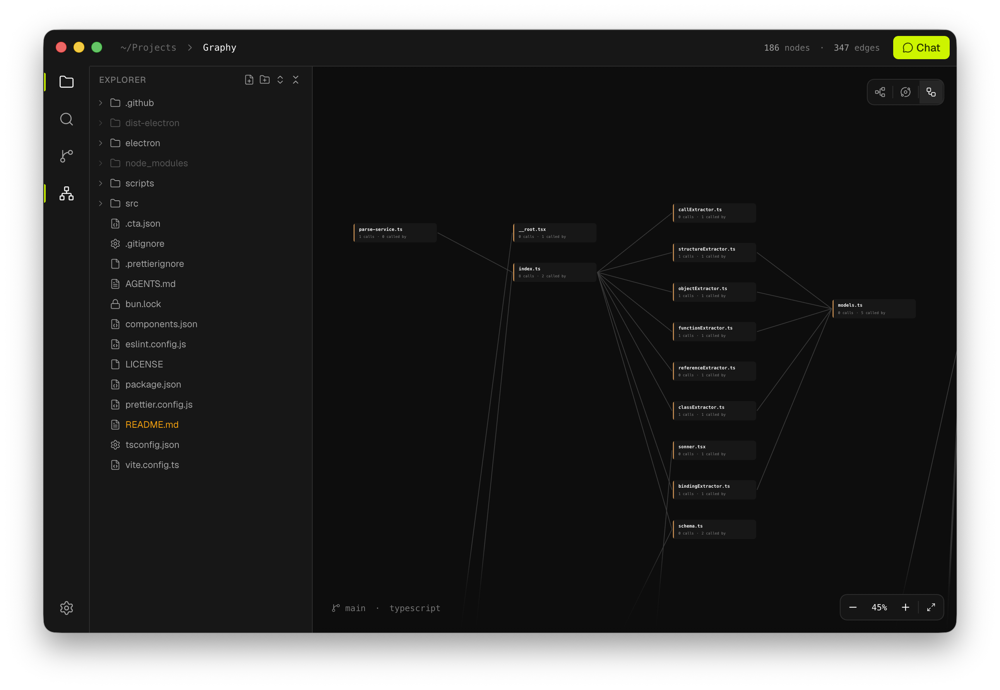

<div align="center">

# Graphy

**Read code as a graph, not as a wall of text.**

Graphy is a desktop IDE that turns a TypeScript codebase into an interactive
graph of files, classes, functions and objects — wired together by the
relationships that actually matter (ownership, calls, references, JSX renders,
hook usage, instantiation, inheritance) — with Claude, Codex and OpenRouter
wired in as first-class collaborators.


</div>



## Why Graphy?

Modern codebases are graphs pretending to be folders. A component renders
another component, a hook is called from three places, a class is instantiated
behind two indirections — yet IDEs still force us to read all of it as a flat
list of `.ts` files.

Graphy flips the model:

- **Nodes for the things that matter.** Files, folders, functions, components,
  hooks, classes, methods, constructors, getters/setters, plain objects and
  arrow bindings — each one is a movable node with a stable
  `file::qualifiedName` id.
- **Edges that mean something.** `owns`, `calls`, `references`, `renders`,
  `uses-hook`, `instantiates`, `extends`, `implements`, `passes-callback`.
- **AI built in.** A unified `AiService` interface backs Claude, Codex and
  OpenRouter, plus a tool layer (`files`, `edits`, `git`, `graph`, `shell`,
  `settings`, `ui`, `web`) the model can call from the in-app chat.

## Tech stack

| Layer           | Choice                                                                                                                                                     |
| --------------- | ---------------------------------------------------------------------------------------------------------------------------------------------------------- |
| Desktop shell   | [Electron](https://www.electronjs.org/) 42                                                                                                                 |
| Web framework   | [TanStack Start](https://tanstack.com/start) + TanStack Router + React 19                                                                                  |
| Graph canvas    | [React Flow](https://reactflow.dev) (`@xyflow/react`) + [Dagre](https://github.com/dagrejs/dagre) auto-layout                                              |
| Code editor     | [CodeMirror 6](https://codemirror.net) (one-dark theme, JS/TS language pack)                                                                               |
| UI primitives   | [shadcn/ui](https://ui.shadcn.com), [Radix](https://www.radix-ui.com), [Base UI](https://base-ui.com), [cmdk](https://cmdk.paco.me)                        |
| Styling         | [Tailwind CSS](https://tailwindcss.com) 4 + `tw-animate-css`                                                                                               |
| Icons           | [Lucide](https://lucide.dev)                                                                                                                               |
| Static analysis | [ts-morph](https://ts-morph.com) (TypeScript compiler API)                                                                                                 |
| Git             | [`simple-git`](https://github.com/steveukx/git-js)                                                                                                         |
| AI providers    | [`@anthropic-ai/sdk`](https://www.npmjs.com/package/@anthropic-ai/sdk), [`@openai/codex-sdk`](https://www.npmjs.com/package/@openai/codex-sdk), OpenRouter |
| Bundler & dev   | [Vite](https://vitejs.dev) 8                                                                                                                               |
| Package manager | [Bun](https://bun.sh)                                                                                                                                      |
| Tests           | [Vitest](https://vitest.dev) 4                                                                                                                             |

## Getting started

### Prerequisites

- [Bun](https://bun.sh) `>= 1.0`
- Electron 42 ships its own Node runtime

### Install

```bash
bun install
```

### Run in development

`bun run dev` starts three processes concurrently: the parser bundle in watch
mode, the Vite dev server on port 3000, and Electron pointed at it.

```bash
bun run dev
```

### Build a desktop release

```bash
bun run dist:mac      # .dmg (x64 + arm64)
bun run dist:linux    # AppImage + .deb
bun run dist:win      # NSIS installer
```

Artifacts land in `release/`.

## Scripts

| Command                        | Description                                                        |
| ------------------------------ | ------------------------------------------------------------------ |
| `bun run dev`                  | Build the parser bundle (watch), start Vite, launch Electron.      |
| `bun run dev:electron`         | Start Electron against an already-running web dev server.          |
| `bun run dev:parser`           | Watch and rebundle the parser CLI into `dist-electron/parser.cjs`. |
| `bun run build`                | Build the parser bundle and the web app.                           |
| `bun run build:parser`         | One-shot bundle of the parser CLI into `dist-electron/parser.cjs`. |
| `bun run start:desktop`        | Build the app and launch Electron.                                 |
| `bun run lint`                 | Run ESLint.                                                        |
| `bun run format`               | Format with Prettier and auto-fix ESLint issues.                   |
| `bun run check`                | Check formatting with Prettier.                                    |
| `bun run tidy`                 | `format` + `lint` — one-shot cleanup before handing off work.      |
| `bun run parser:dump`          | Run the parser against a target project and dump the graph.        |
| `bun run dist:{mac,linux,win}` | Build and package the desktop app for the given platform.          |

## Project structure

The codebase follows a feature-based layout. Imports flow one way:
`routes → app → modules → shared`. Modules don't import from each other —
shared concerns live in `src/shared/`, and each module exposes its public API
through its own `index.ts` barrel.

```
Graphy/
├── electron/                   Electron main process (CommonJS)
│   ├── main.cjs                Window, IPC, app lifecycle
│   ├── menu.cjs                Native menu
│   ├── preload.cjs             Renderer ↔ main bridge
│   ├── parser-service.cjs      Spawns the bundled parser CLI
│   ├── project-state.cjs      Open-project persistence
│   └── watcher.cjs             Filesystem change watcher
├── scripts/
│   └── build-parser.ts         Bundles the parser into a standalone CLI
├── src/
│   ├── app/                    App shell — layout (sidebar, top-bar), styles
│   ├── routes/                 TanStack file-based routes (thin)
│   ├── shared/                 Cross-cutting primitives
│   │   ├── ui/                 shadcn primitives (CLI-managed)
│   │   ├── hooks/
│   │   └── lib/
│   └── modules/                Self-contained feature modules
│       ├── ai/                 Unified AI service (Claude / Codex / OpenRouter) + tools/
│       ├── ai-chat/            In-app chat UI, context, hooks
│       ├── diff-viewer/        Inline diff rendering for AI edits
│       ├── files/              Project file tree + file IO
│       ├── graph/              React Flow canvas, nodes, layout selector
│       ├── node-summary/       Per-node summary panel
│       ├── parser/             ts-morph → Graph extraction
│       ├── search/             Command palette / search
│       ├── settings/           User settings (providers, keys, prefs)
│       ├── source-control/     Git status, diffs, commits via simple-git
│       └── themes/             Theme registry and switching
```

## The parser

`src/modules/parser` is a self-contained ts-morph pipeline that consumes a
project root and returns a validated `Graph`.

1. **Load.** `loadSourceFiles` opens the target codebase via `tsconfig.json`
   if present, or falls back to a glob over `.ts`/`.tsx`/`.js`/`.jsx`.
2. **Pass 1 — nodes.** Each `SourceFile` is fed through
   `extractFunctions`, `extractClasses`, `extractObjects` and
   `extractBindings`. Every result is classified by `classifyNode` into one
   of: `component`, `hook`, `function`, `method`, `arrow`, `class`, `object`,
   `constructor`, `getter`, `setter`.
3. **Pass 2 — edges.** `extractStructuralEdges` resolves ownership, JSX
   renders, hook usage, instantiation, inheritance and callback passing.
   `extractCalls` and `extractReferences` then add direct call and reference
   edges using the compiler's symbol table.
4. **Pass 3 — degree.** Every node is annotated with its `inDegree` and
   `outDegree`.
5. **Validate.** The resulting `Graph` (versioned by `SCHEMA_VERSION`) is
   validated before being handed back.

The parser is bundled into a standalone CJS file (`dist-electron/parser.cjs`)
by `scripts/build-parser.ts` so the Electron main process can spawn it as a
subprocess without dragging the renderer's bundler graph with it.

## The AI layer

`src/modules/ai` exposes a single `AiService` interface (`chat`, `stream`,
`generateObject`) with three implementations:

- `claude.service.ts` — Anthropic SDK
- `openrouter.service.ts` — OpenRouter
- `codex.service.ts` — OpenAI Codex SDK (Node-only; intentionally **not**
  re-exported from the module barrel because the SDK spawns the local `codex`
  CLI and uses Node-only APIs Vite cannot bundle for the renderer)

`src/modules/ai/tools/` defines the tools the model can call during a chat
turn: `edits`, `files`, `git`, `graph`, `settings`, `shell`, `ui`, `web`. The
in-app chat (`src/modules/ai-chat`) renders streamed messages, tool calls and
their results, with diffs rendered through `diff-viewer`.

## Contributing

Before opening a PR, run:

```bash
bun run tidy
```

(That's `format` + `lint`. There is no separate `check` step required for PRs;
CI mirrors `tidy`.)

## Team

Built with care by **[Gabriel BRUMENT](https://github.com/SobshDev)**, **[Raphaël BERTAINA-LOICHEMOL](https://github.com/raph-bl)**, **[Nawfal HASSANI](https://github.com/nawfal-hassani)** and **[Maty MILLIEN](https://github.com/maty-millien)**.

## License

Licensed under the [GNU Affero General Public License v3.0](LICENSE).
